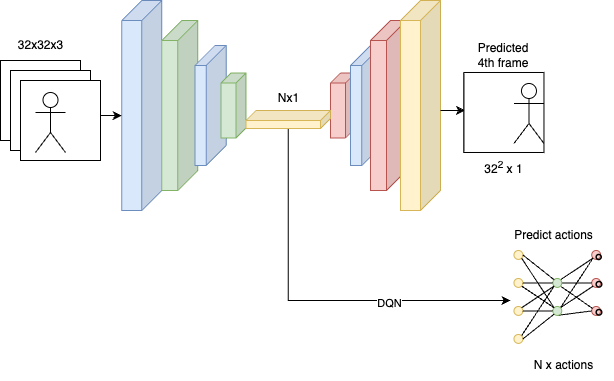

# Summary
This is a fun hobby project to play with frame prediction and reinforcement learning for the video game of Breakout.

In this project I develop an agent using Deep-Q-Network(DQN) that can play a custom made version of breakout. In addition I develop a U-Net Convolutional Neural Network (CNN) that reads three sequential frames and predicts the fourth.

# How to use
This is work in progress and still quite raw. The functionality can be explored via the jupyter notebooks.