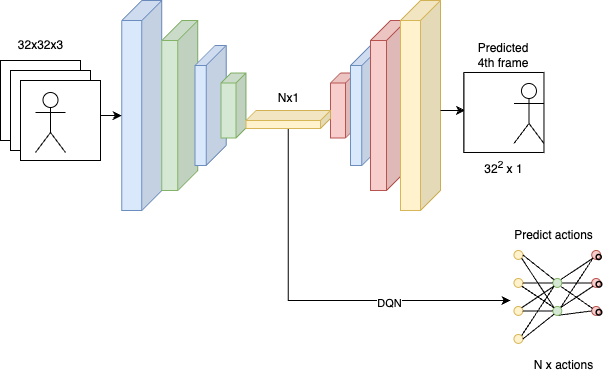
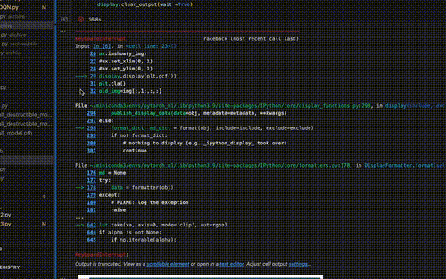
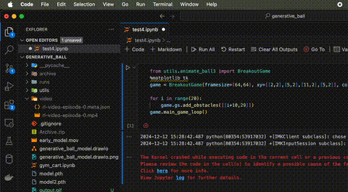

# Summary
This is a fun hobby project to play with frame prediction and reinforcement learning for the video game of Breakout.

In this project I develop an agent using Deep-Q-Network(DQN) that can play a custom made version of breakout. In addition I develop a U-Net Convolutional Neural Network (CNN) that reads three sequential frames and predicts the fourth.

Below is a demo of an early version of the frame prediction. It fails in breaking the blocks when hitting from the corners but works as expected when bouncing of walls and breaks blocks when hitting them on the side.

Next step is simulating the game "Breakout" in python. We need to first create a human playable version of the game and then allow a reinforcement learning agent to take the wheel.

Todo:

1. Create a simple (non-reinforcement)agent that just tries to follow the x position of the ball.
2. Create a simple reinforcement agent that maximizes the reward: proximity to ball in the x direction. The states are the difference of x position between player and ball.
3. Implement so that breaking blocks gives reward to agent, and ball going below the player is punished.

# How to use
This is work in progress and still quite raw. The functionality can be explored via the jupyter notebooks.
